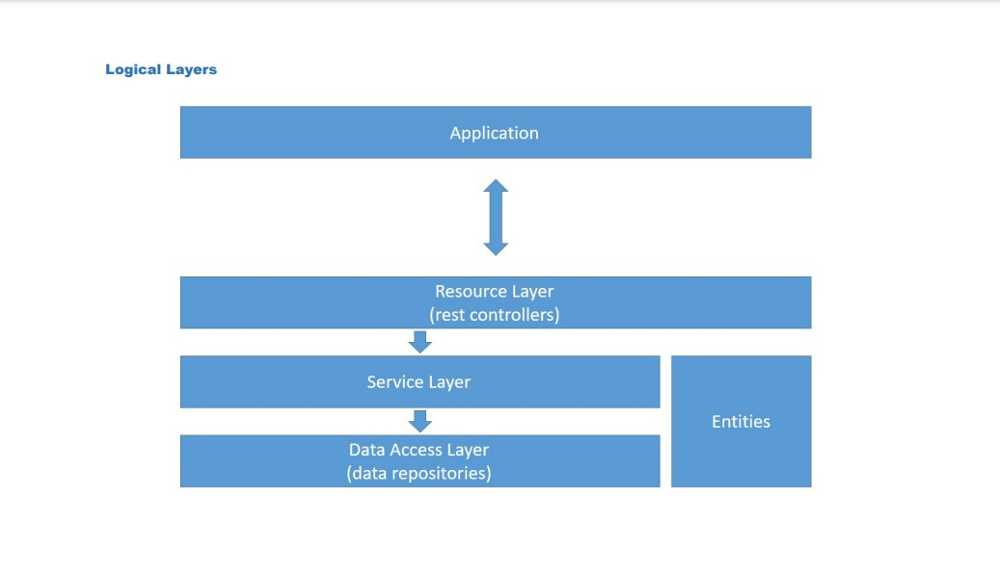

# Own-Ecommerce
A little project I'll be programming to practice the creation of a API using the Java language, its servlet and the SPRING framework, the REST concepts, and MySQL database.

## PROJECT OVERALL ARCHITECTURE
In this project I'll be using an architecture I saw in one of Nelio's, a teacher who's got a lot of Java courses on Udemy, 331th class. You can see it below.

## DATABASE  CONCEPTUAL MODEL

